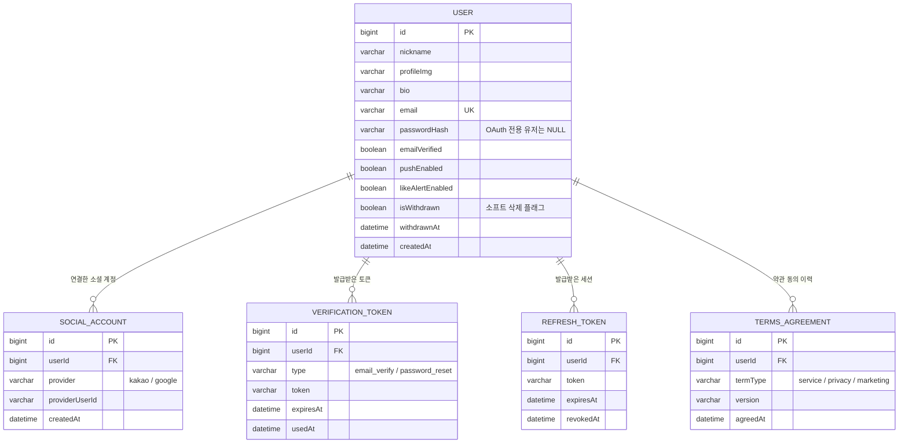
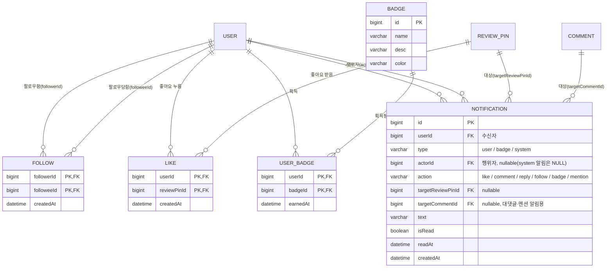
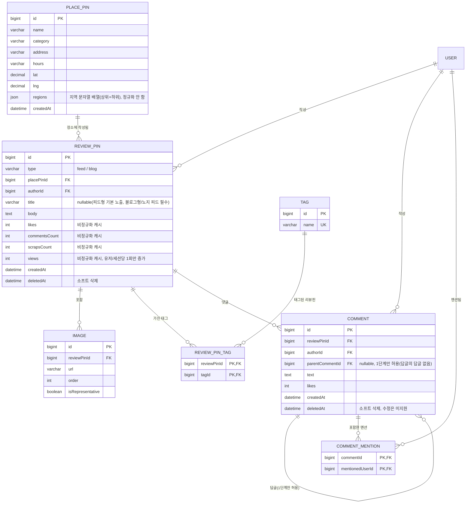
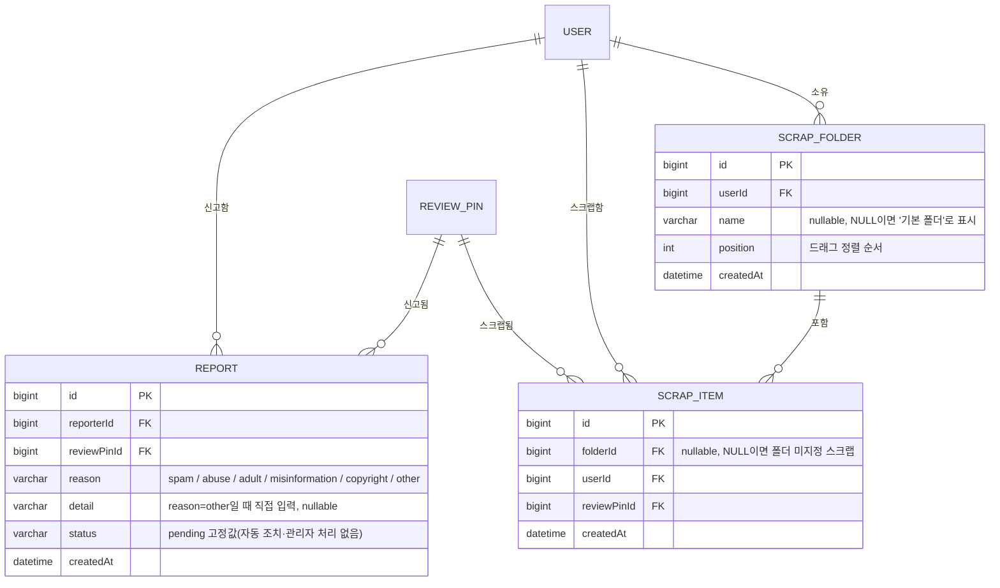

# 핀플 (Pinple) — ERD

`README.md`의 "실서비스 전환 설계 결정 사항"을 근거로 작성한 ERD. 도메인별로 나눠서 표기하며, 표기가 겹치는 테이블(`USER`, `REVIEW_PIN` 등)은 도메인마다 반복 등장한다.

## 표기 범례

- `PK` 기본키, `FK` 외래키, `UK` 유니크 제약, `PK, FK` 복합키의 일부이자 외래키
- `||--o{` : 1 : N (왼쪽 1, 오른쪽 0..N)
- 조인 테이블(다대다)은 별도 엔티티로 명시하고, 각 원본 테이블과 1:N 관계로 표현한다.
- 카테고리(`categories`)는 DB 테이블이 아니라 애플리케이션 상수(고정 배열)로 관리한다 — 목업의 `dummy.js`와 동일.

## 도메인 분리 기준 및 중복 등장 테이블

4개로 나눈 기준은 **기능 도메인**(인증/계정 · 소셜 · 콘텐츠 · 스크랩·신고)이며, 특정 테이블을 중심으로 나눈 것이 아니다. 다만 실제 FK 관계상 여러 도메인에 걸쳐 참조되는 테이블이 있어 아래처럼 반복 등장한다. **전체 속성 정의는 해당 테이블이 주인공인 도메인 다이어그램 한 곳에만 있고, 나머지 도메인에서는 관계선으로만 참조**된다(속성 박스 없이 이름만 등장).

| 테이블 | 등장 도메인 | 전체 정의 위치 | 비고 |
|---|---|---|---|
| `USER` | 1, 2, 3, 4 (전부) | 1. 인증/계정 | 거의 모든 테이블이 "누가 했는지"를 참조하므로 전 도메인의 허브 |
| `REVIEW_PIN` | 2, 3, 4 | 3. 콘텐츠 | 2번(좋아요 받음·알림 대상), 4번(스크랩됨·신고됨)에서 참조만 |
| `COMMENT` | 2, 3 | 3. 콘텐츠 | 2번(대댓글 알림 대상)에서 참조만 |

---

## 1. 인증 / 계정 도메인

| 테이블 | 비고 |
|---|---|
| `USER.email` | 가입 방식(이메일/카카오/구글)과 무관하게 전체 유일. OAuth-이메일 계정 병합 정책의 전제 조건 |
| `USER.passwordHash` | OAuth만으로 가입한 유저는 `NULL` |
| `VERIFICATION_TOKEN` | 이메일 인증·비밀번호 재설정 공용. `type`으로 구분 |
| `REFRESH_TOKEN` | 로그아웃/탈취 시 `revokedAt`을 채워 무효화 |
| `TERMS_AGREEMENT` | 서비스 이용약관·개인정보처리방침·마케팅 수신 동의를 버전과 함께 로그로 남김 |

---

## 2. 소셜 도메인 (팔로우 · 좋아요 · 알림 · 뱃지)

| 테이블 | 비고 |
|---|---|
| `FOLLOW` / `LIKE` | 목업의 하드코딩 배열·boolean을 대체하는 정식 조인 테이블 |
| `BADGE` | 8개 고정, 획득 조건은 코드에 하드코딩(테이블에 조건 컬럼 없음) |
| `USER_BADGE` | 조건 충족 시 관련 액션 API 내부에서 동기적으로 insert |
| `NOTIFICATION` | 배치 없이 액션 API 내부에서 동기 생성. `isRead`/`readAt`으로 읽음 상태 서버 영속화 |

`ReviewPin.likes` / `comments` / `scraps` / `views`는 `LIKE`, `COMMENT`, `SCRAP_ITEM` 테이블의 실제 행에서 파생되지만, 조회 성능을 위해 `REVIEW_PIN`에 비정규화된 캐시 컬럼으로 별도 유지한다 (3번 다이어그램 참고).

---

## 3. 콘텐츠 도메인 (장소 · 리뷰핀 · 이미지 · 태그 · 댓글 · 멘션)

| 테이블 | 비고 |
|---|---|
| `PLACE_PIN.regions` | 정규화하지 않고 목업 방식(문자열 배열에 상위+하위 지역 같이 저장) 그대로 유지 |
| `PLACE_PIN` | `todayReviewCount`는 저장하지 않고 `REVIEW_PIN`을 KST 자정 기준으로 실시간 COUNT (아래 "계산 필드" 참고) |
| `REVIEW_PIN.title` | 피드형은 노지 등록일 때만 필수, 블로그형은 항상 필수 (RegisterView 로직과 동일) |
| `IMAGE` | 배열 컬럼이 아닌 별도 테이블로 분리, `order`+`isRepresentative`로 목업의 대표이미지 개념 표현 |
| `TAG` / `REVIEW_PIN_TAG` | 정규화 — 인기 태그 집계·태그 검색에 사용 |
| `COMMENT.parentCommentId` | 셀프 참조지만 애플리케이션 레벨에서 1단계 이상 중첩 금지(부모의 부모가 있으면 안 됨)를 강제 |
| `COMMENT_MENTION` | 멘션 대상은 userId로 저장(닉네임 변경에 안전). 단, `COMMENT.text` 자체엔 작성 시점 닉네임이 그대로 박제되므로, 이 테이블은 **알림 발송 대상 조회 전용** |

---

## 4. 스크랩 / 신고 도메인

| 테이블 | 비고 |
|---|---|
| `SCRAP_FOLDER` | 기본 폴더를 실제 row로 만들지 않음(`SCRAP_ITEM.folderId`가 NULL이면 미지정 상태) |
| `REPORT` | 리뷰핀 대상만 지원(댓글 신고 없음). `(reporterId, reviewPinId)` UNIQUE로 중복 신고 방지 |
| `REPORT.status` | 이번 스코프는 접수(기록)까지만 — 관리자 처리/자동 조치 로직 없음 |

차단(Block) 기능은 이번 스코프에 없어 테이블도 없다.

---

## 5. 전체 테이블 요약

| 도메인 | 테이블 |
|---|---|
| 인증/계정 | `USER`, `SOCIAL_ACCOUNT`, `VERIFICATION_TOKEN`, `REFRESH_TOKEN`, `TERMS_AGREEMENT` |
| 소셜 | `FOLLOW`, `LIKE`, `BADGE`, `USER_BADGE`, `NOTIFICATION` |
| 콘텐츠 | `PLACE_PIN`, `REVIEW_PIN`, `IMAGE`, `TAG`, `REVIEW_PIN_TAG`, `COMMENT`, `COMMENT_MENTION` |
| 스크랩/신고 | `SCRAP_FOLDER`, `SCRAP_ITEM`, `REPORT` |

총 17개 테이블. DB 테이블이 아닌 애플리케이션 상수: `categories`(고정 배열).

---

## 6. 설계 노트

- **소프트 삭제 대상**: `USER`(`isWithdrawn`), `REVIEW_PIN`(`deletedAt`), `COMMENT`(`deletedAt`). 탈퇴 시 `FOLLOW` 관계는 실제로 삭제하되, 작성한 콘텐츠는 남기고 작성자 표시만 "탈퇴한 사용자입니다"로 대체.
- **계산 필드(저장하지 않음)**: `PlacePin`의 "오늘의 핀 수"는 컬럼으로 두지 않고, `REVIEW_PIN`을 `placePinId` + `createdAt >= 오늘 00:00(KST)` 조건으로 실시간 COUNT.
- **비정규화 캐시 컬럼**: `REVIEW_PIN.likes/commentsCount/scrapsCount/views`는 각각 `LIKE`/`COMMENT`/`SCRAP_ITEM` 테이블 및 조회수 증가 로직에서 파생되지만, 매 조회마다 COUNT하지 않고 캐시 컬럼으로 관리(액션 API에서 증감).
- **검색 인덱스**: `REVIEW_PIN(title, body)`, `PLACE_PIN(name)`에 MySQL `FULLTEXT INDEX ... WITH PARSER ngram` 적용 예정 (형태소 분석 없는 단순 매칭 목적).
- **홈 랜덤 탭**: 별도 테이블 없음 — 클라이언트가 들고 있는 시드 값을 쿼리 파라미터로 서버에 전달하면, 서버가 `ORDER BY MD5(reviewPinId || seed)` 방식으로 결정적 정렬을 계산.
